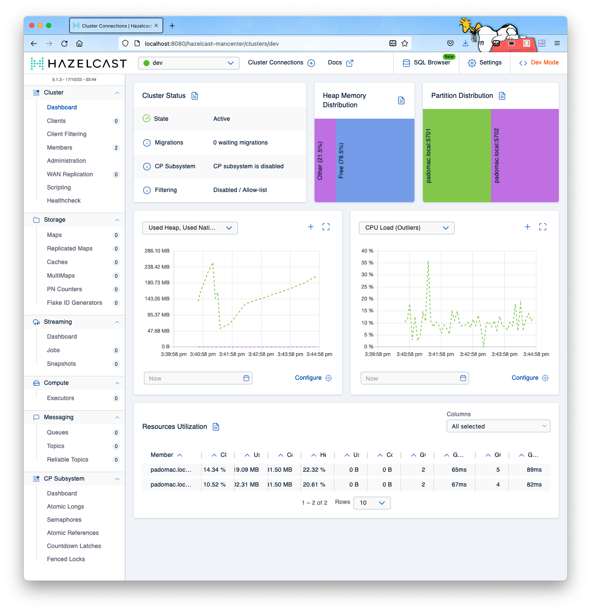

 [*PadoGrid*](https://github.com/padogrid) | [*Catalogs*](https://github.com/padogrid/catalog-bundles/blob/master/all-catalog.md) | [*Manual*](https://github.com/padogrid/padogrid/wiki) | [*FAQ*](https://github.com/padogrid/padogrid/wiki/faq) | [*Releases*](https://github.com/padogrid/padogrid/releases) | [*Templates*](https://github.com/padogrid/padogrid/wiki/Using-Bundle-Templates) | [*Pods*](https://github.com/padogrid/padogrid/wiki/Understanding-Padogrid-Pods) | [*Kubernetes*](https://github.com/padogrid/padogrid/wiki/Kubernetes) | [*Docker*](https://github.com/padogrid/padogrid/wiki/Docker) | [*Apps*](https://github.com/padogrid/padogrid/wiki/Apps) | [*Quick Start*](https://github.com/padogrid/padogrid/wiki/Quick-Start)

---

# 6. Start Hazelcast cluster

Either you have a VM-enabled workspace or not, the PadoGrid commands work the same way. Let's start the cluster and Hazelcast Management Center.

```bash
# The '-all' option starts both members and management center
start_cluster -all
```

Once started, you can check the cluster status by running `show_cluster`

```bash
# Display short running status 
show_cluster

# Display detailed status
show_cluster -long
```

For Hazelcast, you can view the Management Center (MC) status separtely by running `show_mc` as follows.

```bash
show_mc
show_mc -long
```

## 6.1. Configure Ports

Follow the instructions in one of the subsections that applies to your environment.

### 6.1.1.  Local Machine

Nothing to do.

### 6.1.2. Docker

Nothing to do. Docker ports have already beeen exposed.

### 6.1.3. Kubernetes

Forward the Pulse port to your host OS.

```bash
# Hazelcast Management Center
kubectl port-forward svc/padogrid 8080
```

### 6.1.4. OpenShift

Expose the Pulse port by executing the following:

```bash
oc expose svc padogrid --name hazelcast-mc --port 8080
oc get route
```

Output:

```console
NAME           HOST/PORT                                PATH   SERVICES   PORT   TERMINATION   WILDCARD
hazelcast-mc   hazelcast-mc-padogrid.apps-crc.testing          padogrid   8080                 None
padogrid       padogrid-padogrid.apps-crc.testing              padogrid   8888                 None
```

## 6.2. Local Machine, Docker, Kubernetes

### 6.2.1. Hazelcast Management Center

Pulse URL: 
Helcast Management Center URL: <http://localhost:8080/hazelcast-mancenter>

- Username: admin
- Password: admin

## 6.3. OpenShift

### 6.3.1. Hazelcast Management Center

Geode/GemFire Pulse URL: <http://hazelcast-mc-padogrid.apps-crc.testing>

- Username: admin
- Password: admin

## 6.4. Browse Hazelcast Management Center

PadoGrid closely follows the Hazelcast default settings. This means the default Hazelcast cluster name is **dev**, and not **myhz**. This, of course, can be changed easily in the Hazelcast configuration file, but for now, let's stick with **dev**.

- From the browser, select the *ENABLE* button for *DEV MODE*.
- Select the *Add* button under the *Cluster Connections* pane.
- Keep the default settings and select the *CONNECT* button in the *Connect Cluster/Connect Directly* page.
- From the *Cluster Connection*" pane, select the *VIEW CLUSTER* button to open the management center.

Upon successful connection, you should see the Management Center view similar to the following image.



---

 [*PadoGrid*](https://github.com/padogrid) | [*Catalogs*](https://github.com/padogrid/catalog-bundles/blob/master/all-catalog.md) | [*Manual*](https://github.com/padogrid/padogrid/wiki) | [*FAQ*](https://github.com/padogrid/padogrid/wiki/faq) | [*Releases*](https://github.com/padogrid/padogrid/releases) | [*Templates*](https://github.com/padogrid/padogrid/wiki/Using-Bundle-Templates) | [*Pods*](https://github.com/padogrid/padogrid/wiki/Understanding-Padogrid-Pods) | [*Kubernetes*](https://github.com/padogrid/padogrid/wiki/Kubernetes) | [*Docker*](https://github.com/padogrid/padogrid/wiki/Docker) | [*Apps*](https://github.com/padogrid/padogrid/wiki/Apps) | [*Quick Start*](https://github.com/padogrid/padogrid/wiki/Quick-Start)
