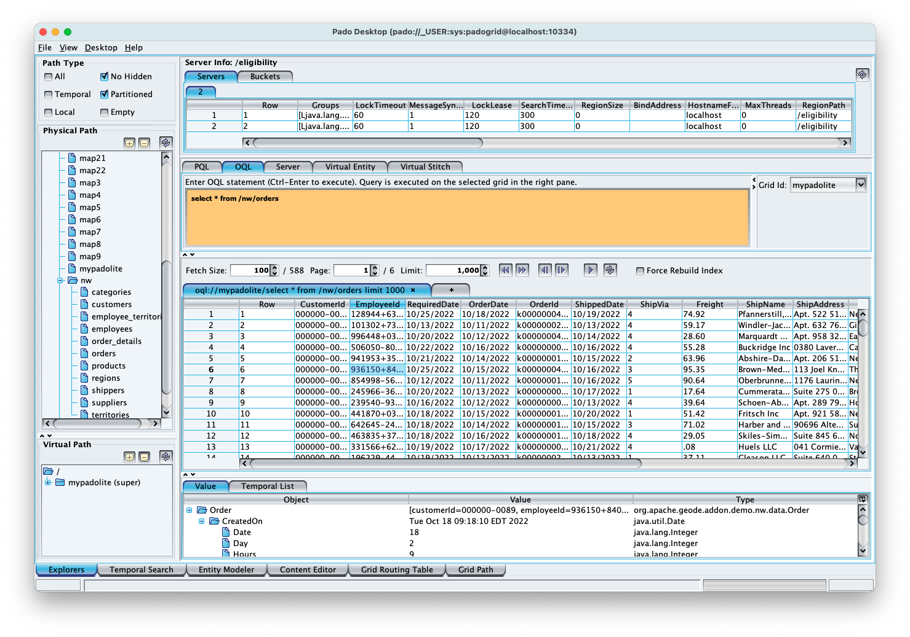

 [*PadoGrid*](https://github.com/padogrid) | [*Catalogs*](https://github.com/padogrid/catalog-bundles/blob/master/all-catalog.md) | [*Manual*](https://github.com/padogrid/padogrid/wiki) | [*FAQ*](https://github.com/padogrid/padogrid/wiki/faq) | [*Releases*](https://github.com/padogrid/padogrid/releases) | [*Templates*](https://github.com/padogrid/padogrid/wiki/Using-Bundle-Templates) | [*Pods*](https://github.com/padogrid/padogrid/wiki/Understanding-Padogrid-Pods) | [*Kubernetes*](https://github.com/padogrid/padogrid/wiki/Kubernetes) | [*Docker*](https://github.com/padogrid/padogrid/wiki/Docker) | [*Apps*](https://github.com/padogrid/padogrid/wiki/Apps) | [*Quick Start*](https://github.com/padogrid/padogrid/wiki/Quick-Start)

---

## 20. Create and run PadoDesktop app

For Geode and GemFire, we can use PadoDesktop to browse the data stored in the cluster. Note that PadoDesktop can only run on Pado-enabled clusters. Let's create and run a PadoDekstop app instance.

```bash
create_app -product geode -app padodesktop
cd_app padodesktop/bin_sh
./desktop
```

Login as you did before with HazelcastDesktop. Enter any user name and password to login. Once logged in, select any of the following regions (maps) from left pane to view their data.

- eligibility
- profile
- nw/customers
- nw/orders

You can also execute Geode/GemFire OQL statements from the OQL tab pane. In Geode/GemFire, regions can be nested and follows the Unix path conventions. Nested regions are separted by the '/' notation. For example, the following queries '/nw/customers' and /nw/orders regions.

✏️ *Note that OQL in Geode and GemFire requires the region paths must begin with `/`.*

```console
select * from /nw/customers
select * from /nw/orders
```



---

 [*PadoGrid*](https://github.com/padogrid) | [*Catalogs*](https://github.com/padogrid/catalog-bundles/blob/master/all-catalog.md) | [*Manual*](https://github.com/padogrid/padogrid/wiki) | [*FAQ*](https://github.com/padogrid/padogrid/wiki/faq) | [*Releases*](https://github.com/padogrid/padogrid/releases) | [*Templates*](https://github.com/padogrid/padogrid/wiki/Using-Bundle-Templates) | [*Pods*](https://github.com/padogrid/padogrid/wiki/Understanding-Padogrid-Pods) | [*Kubernetes*](https://github.com/padogrid/padogrid/wiki/Kubernetes) | [*Docker*](https://github.com/padogrid/padogrid/wiki/Docker) | [*Apps*](https://github.com/padogrid/padogrid/wiki/Apps) | [*Quick Start*](https://github.com/padogrid/padogrid/wiki/Quick-Start)
