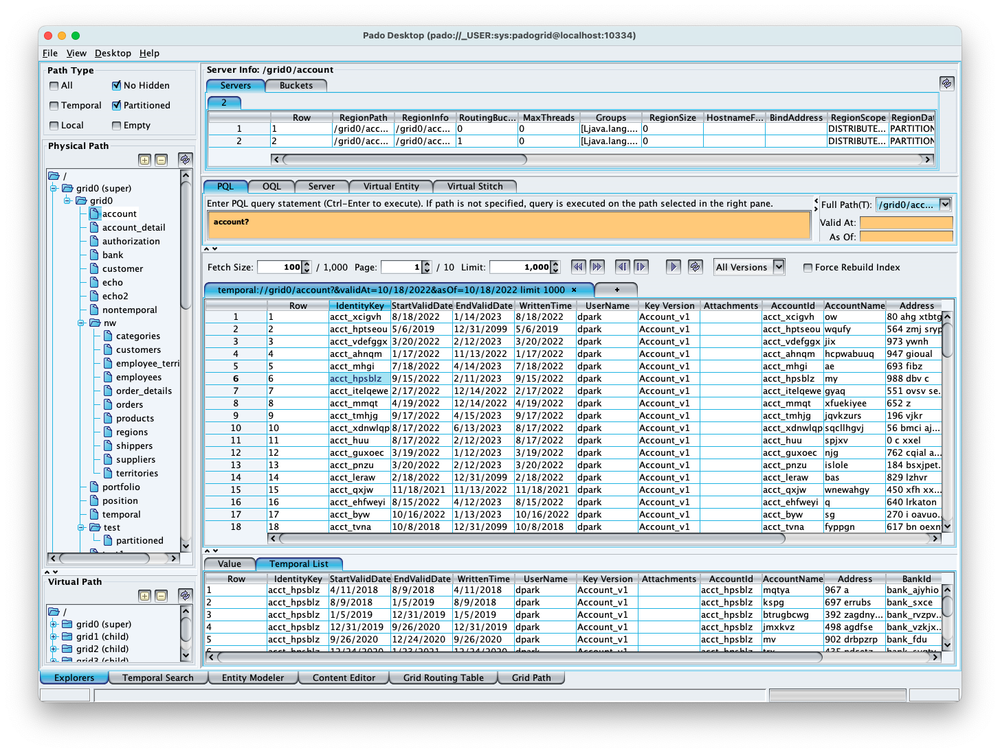
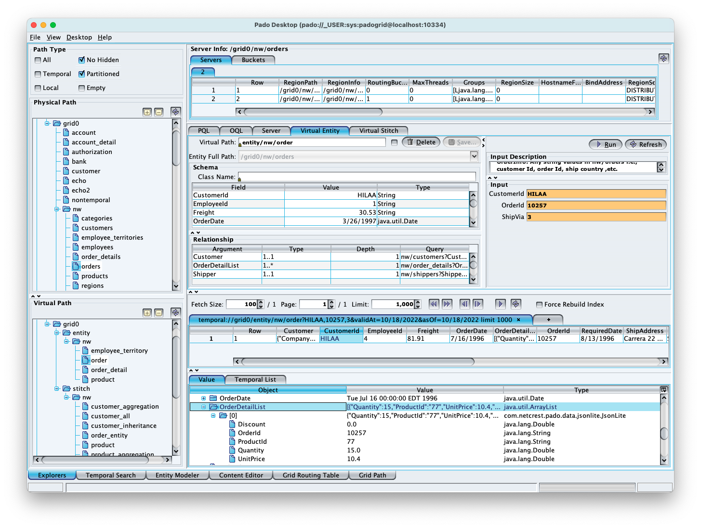

 [*PadoGrid*](https://github.com/padogrid) | [*Catalogs*](https://github.com/padogrid/catalog-bundles/blob/master/all-catalog.md) | [*Manual*](https://github.com/padogrid/padogrid/wiki) | [*FAQ*](https://github.com/padogrid/padogrid/wiki/faq) | [*Releases*](https://github.com/padogrid/padogrid/releases) | [*Templates*](https://github.com/padogrid/padogrid/wiki/Using-Bundle-Templates) | [*Pods*](https://github.com/padogrid/padogrid/wiki/Understanding-Padogrid-Pods) | [*Kubernetes*](https://github.com/padogrid/padogrid/wiki/Kubernetes) | [*Docker*](https://github.com/padogrid/padogrid/wiki/Docker) | [*Apps*](https://github.com/padogrid/padogrid/wiki/Apps) | [*Quick Start*](https://github.com/padogrid/padogrid/wiki/Quick-Start)

---

## 24. Monitor Pado clusters

You can use PadoDesktop to monitor Pado clusters.

```bash
cd_app padodesktop/bin_sh
./desktop
```

PadoDesktop should look similar to the image show below. It shows five (5) grids. The `grid0` cluster is the parent to other clusters. We have only ingested data into parent cluster so you will only see data in `grid0`.



Pado supports a hybrid language called PQL (Pado Query Language) that combines support for Lucene and OQL. It also includes preliminary support for virtual paths which are similar to materialized views in relational databases. You can create virtual paths on top of physical and/or virtual paths and query them using PQL. 

Try the following examples:

### 24.1. PQL

```
--Query all account data
account?

--Query account Id 'acct_aa'
account?acct_aa

--Query account Id starts with 'acct_aa'
account?acct_aa*

--Query account Id starts with 'acct_aa'
account?acct_aa*

--Query accounts beginning with the account name 'sfd' and addressese that have 'ari'
account?AccountName:sfd* AND Address:ari*

--Left-join 'nw/custtomers' and 'nw/orders' regions
select * from nw/customers c
join nw/orders o on c.CustomerId:o.CustomerId
join nw/shippers ship ON ship.ShipperId:o.ShipVia
join nw/order_details od ON od.OrderId:o.OrderId
join nw/products p ON p.ProductId:od.ProductId
join nw/suppliers s ON s.SupplierId:p.SupplierId
```

[Lucene Query Paser Syntax](https://lucene.apache.org/core/9_4_0/queryparser/org/apache/lucene/queryparser/classic/package-summary.html#package.description) provides Lucene syntax details.

### 24.2. OQL

Pado creates all *grid paths* under the unique grid ID, which is analogous to the cluster name. For example, the parent grid has the grid ID, 'grid0'. To execute OQL statements, the region path must include the grid ID as shown in the examples shown below.

```sql
--Query all from the 'account' region
select * from /grid0/account
```

### 24.3. Server and Buckets

You can also target your queries to individual servers and buckets. From the "Server" tab, first select a region path, server and bucket. Then execute your OQL statement.

```sql
--Query all accounts from the selected server or bucket
select * from /grid0/account
```

### 24.4. Virtual Path

From the left lower pane, select any of the example virtual paths. Depending on which one you select you will see its details in the Virtual Entity or Virtual Stitch pane. The following image shows query results of the virtual path, `entity/nw/order` that requires the input parameters of `CustomerId`, `OrderId`, and `ShipVia`. Note that the virtual path has one-to-one and one-to-many entity relationships defined. The query result shows an aggregated list of `OrderDetailList`.



---

 [*PadoGrid*](https://github.com/padogrid) | [*Catalogs*](https://github.com/padogrid/catalog-bundles/blob/master/all-catalog.md) | [*Manual*](https://github.com/padogrid/padogrid/wiki) | [*FAQ*](https://github.com/padogrid/padogrid/wiki/faq) | [*Releases*](https://github.com/padogrid/padogrid/releases) | [*Templates*](https://github.com/padogrid/padogrid/wiki/Using-Bundle-Templates) | [*Pods*](https://github.com/padogrid/padogrid/wiki/Understanding-Padogrid-Pods) | [*Kubernetes*](https://github.com/padogrid/padogrid/wiki/Kubernetes) | [*Docker*](https://github.com/padogrid/padogrid/wiki/Docker) | [*Apps*](https://github.com/padogrid/padogrid/wiki/Apps) | [*Quick Start*](https://github.com/padogrid/padogrid/wiki/Quick-Start)
