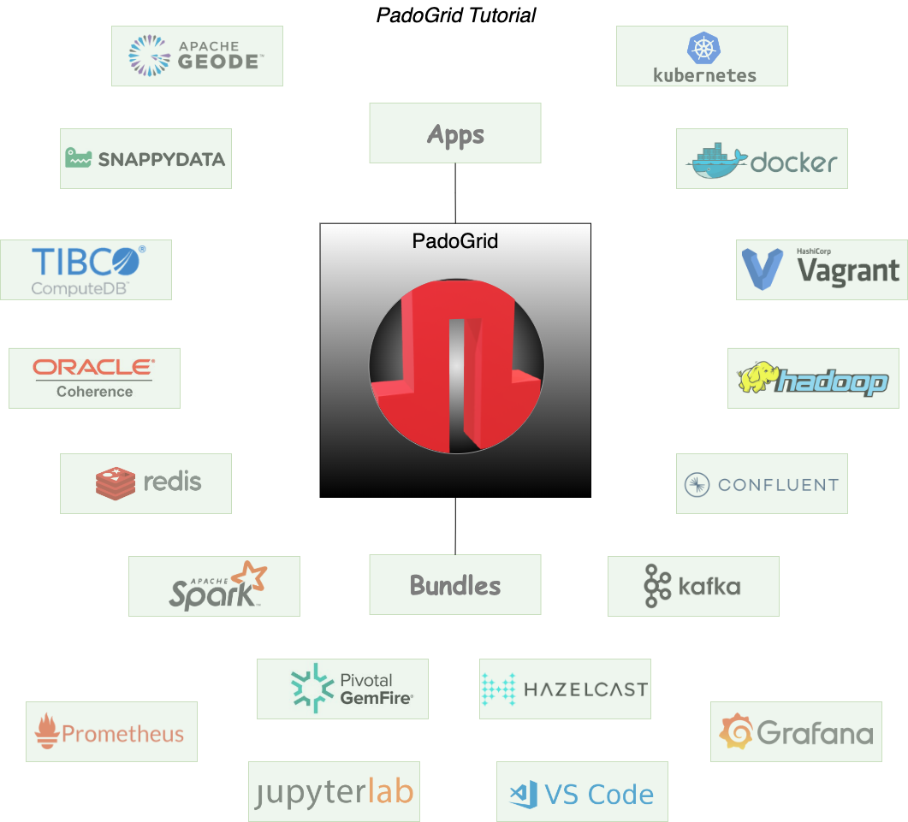
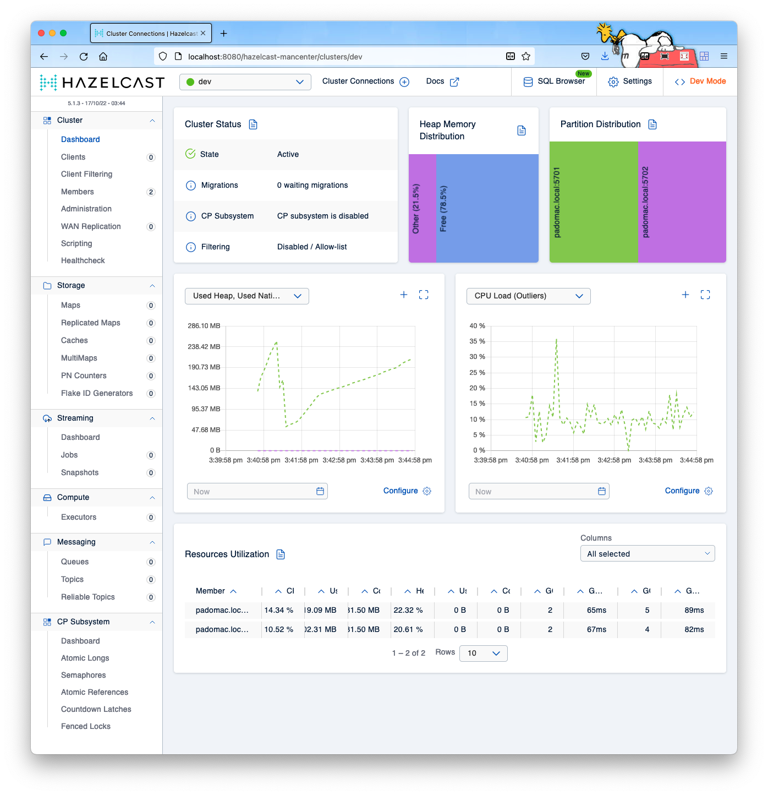
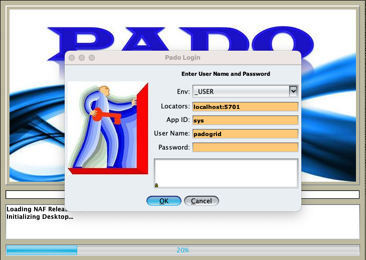
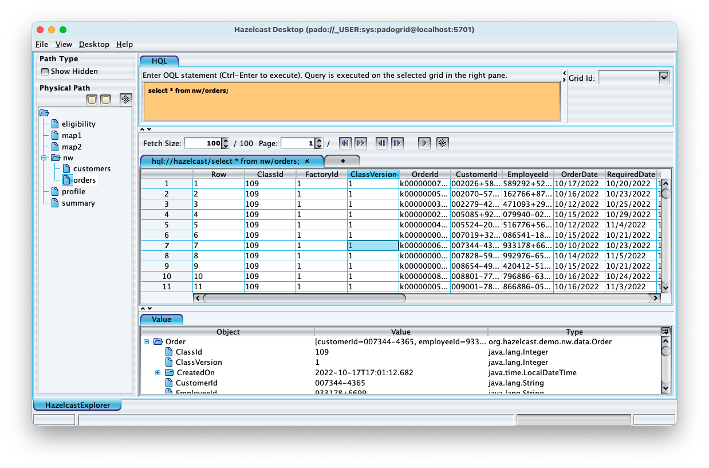
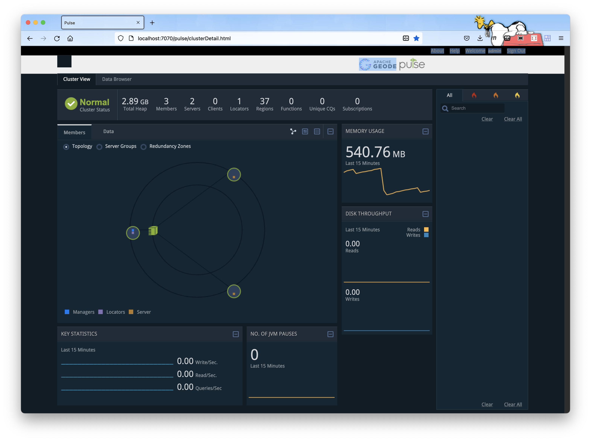
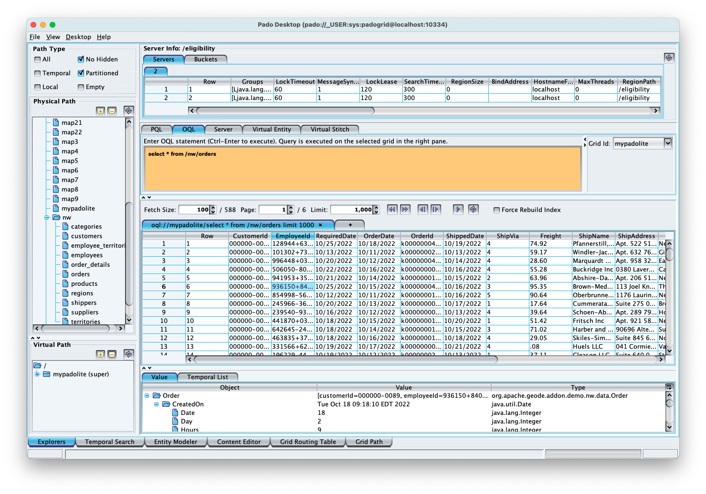
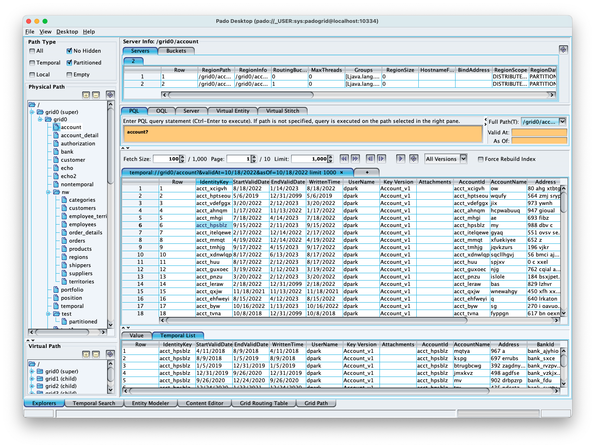
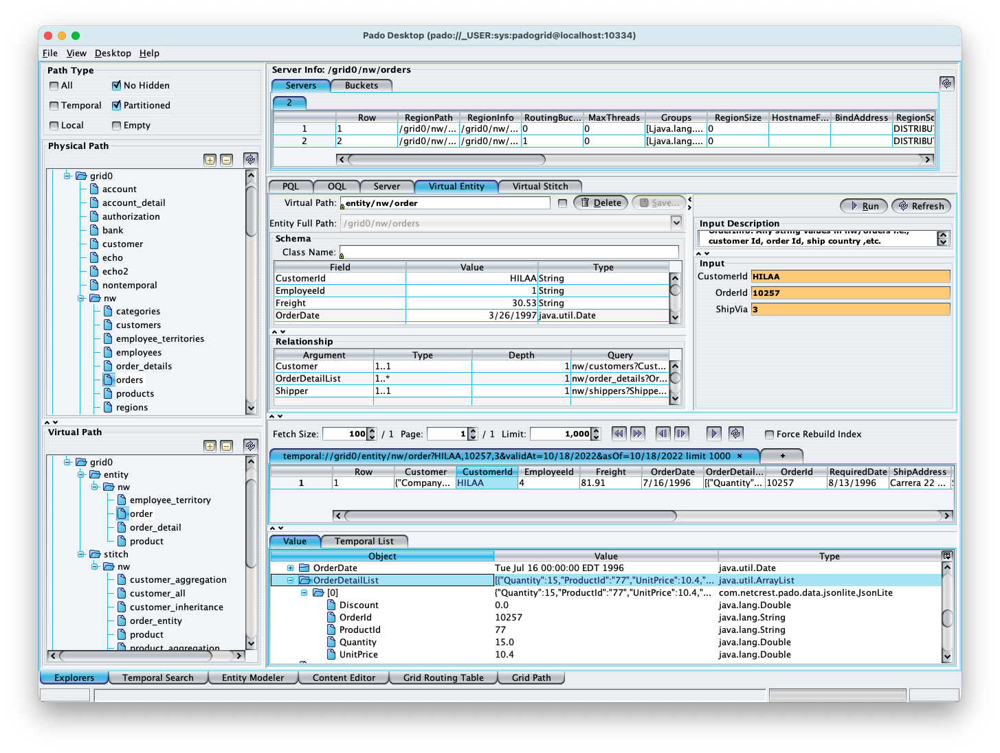

 [*PadoGrid*](https://github.com/padogrid) | [*Catalogs*](https://github.com/padogrid/catalog-bundles/blob/master/all-catalog.md) | [*Manual*](https://github.com/padogrid/padogrid/wiki) | [*FAQ*](https://github.com/padogrid/padogrid/wiki/faq) | [*Releases*](https://github.com/padogrid/padogrid/releases) | [*Templates*](https://github.com/padogrid/padogrid/wiki/Using-Bundle-Templates) | [*Pods*](https://github.com/padogrid/padogrid/wiki/Understanding-Padogrid-Pods) | [*Kubernetes*](https://github.com/padogrid/padogrid/wiki/Kubernetes) | [*Docker*](https://github.com/padogrid/padogrid/wiki/Docker) | [*Apps*](https://github.com/padogrid/padogrid/wiki/Apps) | [*Quick Start*](https://github.com/padogrid/padogrid/wiki/Quick-Start)

---

# PadoGrid Tutorial

This tutorial bundle covers PadoGrid essentials.

## Installing Bundle

```bash
install_bundle -checkout bundle-none-tutorial-padogrid
```

## Use Case

PadoGrid is a productivity toolkit for managing user workspaces in the server-side. It is commonly used for creating distributed workspaces on your laptop to manage various clustering products running locally and remotely. Managing clustering (or data grid) products such as GemFire, Hazelcast, Redis, Coherence, Spark, Kafka, Hadoop, etc. is a complex task that often requires development and maintenance of custom scripts. Each product comes with a simple set of script but they are typically for running a single cluster member instance on your local machine. You are left with the time-consuming task of manually deploying, configuring, running, and managing each member that belongs to a cluster. The complexity of this task multiplies as you add more members to the cluster and include more clusters and products in your system architecture, and not to mention, a steep learning curve of each product's scripts demanding a significant amount of time and efforts.

PadoGrid solves this problem by providing a single, unified set of commands for managing data grid products. The same set of commands applies to all the [supported data grid products](https://github.com/padogrid/padogrid/wiki/Supported-Data-Grid-Products-and-Downloads). For products that are not supported, they can be found in *bundles* as part of solutions. Each bundle is a shrink-wrapped, turnkey solution capturing an end-to-end use case that you can simply install and run. Including this tutorial bundle, there are numerous [public online bundles](https://github.com/padogrid/catalog-bundles/blob/master/all-catalog.md) that are made readily available for you to use. All for free and all for fun!

PadoGrid was built from the beginning to bring the concept of *distributed workspaces* to practice by allowing you to create sandbox environments on the fly. PadoGrid isolates each workspace that you create from other workspaces so that you can instead focus on your application. The bundles are the direct results of this concept as they need to be run in isolated environments to prevent workspace conflicts. In this tutorial bundle, we will explore some of the commonly used PadoGrid commands to understand the benefits of having distributed workspaces. 



## Required OS/Platform

One of the following OS's or platforms:

- Linux
- macOS
- Windows (Cygwin, WSL)
- Docker
- Kubernetes

## Required Software

- [Bash](https://www.gnu.org/software/bash/)
- [Maven 3.x](https://maven.apache.org/download.cgi)
- [Git](https://maven.apache.org/download.cgi)
- [JDK 8+](https://www.oracle.com/java/technologies/downloads/)

## Optional Software

- [jq](https://stedolan.github.io/jq/)

## 0. Install PadoGrid

PadoGrid requires `bash` and can be installed on Linux, macOS, Windows with Cygwin or WSL, Docker, or Kubernetes. It also requires Maven 3.x and Git for building apps and bundles. Java is also required by most of the cluster products. The optional `jq` executable is also recommended for handling JSON values. Make sure you have them installed before proceeding with the tutorial.

### Linux, macOS, Windows (Cygwin, WSL)

By default, PadoGrid installs in your home directory under the `~/Padogrid` directory. You can change this directory by running the `install_padogrid` script. For our tutorial, let's install it in the default directory. The following `curl` command silently installs PadoGrid and Hazelcast OSS.

```bash
curl -fsSL https://raw.githubusercontent.com/padogrid/padogrid/develop/padogrid-deployment/src/main/resources/common/bin_sh/install_padogrid | /bin/bash -s -- -no-stty -quiet -product hazelcast-oss
```

Upon installation, execute the following to initialize PadoGrid. Note that PadoGrid only runs in `bash`. If `bash` is not your default shell, then you must manually run `bash` to initialize PadoGrid.

```bash
. ~/Padogrid/workspaces/myrwe/initenv.sh -quiet
echo ". ~/Padogrid/workspaces/myrwe/initenv.sh -quiet" >> ~/.bashrc
```

### Docker

```bash
docker run -it --rm padogrid/padogrid /bin/bash
```

### Podman

```bash
podman run -it --rm padogrid/padogrid /bin/bash
```

### Kubernetes

```bash
kubectl run padogrid --image=docker.io/padogrid/padogrid
```

### OpenShift

```bash
oc run padogrid --image=docker.io/padogrid/padogrid
```

### Directory Layout

Let's take a look at the default directory where PadoGrid is installed.

If you installed PadoGrid on OS, then its default directory is `$HOME/Padogrid` and has the following directory layout.

```bash
tree -L 2 ~/Padogrid
```

You should see the directory structure similar to the following.

```console
~/Padogrid/
├── downloads
│   ├── hazelcast-5.1.4-slim.tar.gz
│   └── padogrid_0.9.21.tar.gz
├── products
│   ├── hazelcast-5.1.4-slim
│   └── padogrid_0.9.21
├── snapshots
└── workspaces
    └── myrwe
```

If you are running PadoGrid in Docker or Kubernetes, then the PadoGrid directory is `/opt/padogrid` and has the directory structure as follows.

```bash
tree -L 2 /opt/padogrid
```

```bash
/opt/padogrid
├── downloads
├── padogrid_start
├── products
│   ├── hazelcast-5.1.3-slim
│   ├── hazelcast-management-center-5.1.4
│   └── padogrid_0.9.21
└── workspaces
    └── myrwe
```

- The `downloads` directory contains the downloads done by the `install_padogrid` command. PadoGrid distributions include this command so that you can use it to install additional products at any time.

- The `padogrid_start` script is a bootstrap script for Docker and Kubernetes. You can ignore that file.

- The `products` directory contains the installed products. Product installations are typically done by inflating the downloads. For example, the downloaded `hazelcast-5.1.4-slim.tar.gz` and `padogrid_0.9.21.tar.gz` distributions are inflated by `install_padogrid` in `products/hazelcast-5.1.4-slim` and `products/padogrid_0.9.21`, respectively.

- The `snapshots` directory is reserved for future use. PadoGrid snapshot builds are also available and installable using `install_padogrid`. Note that the snapshots are currently installed in the `products` directory, not in the `snapshots` directory. This may change in the future.

- The `workspaces` directory contains user workspaces. The `workspaces/myrwe` directory is the default RWE (Root Workspaces Environment) that contains the default `myws` workspace created by `install_padogrid`. We will go over the workspace directory contents shortly in this tutorial.

In addition to `~/Padogrid`, PadoGrid creates the `~/.padogrid` directory to store workspace metadata as shown below. We will touch up on the use of this directory later.

```bash
tree ~/.padogrid
```

Output:

```console
~/.padogrid
├── setenv.sh
└── workspaces
    └── myrwe
        └── myws
            ├── clusters
            │   └── myhz
            │       └── clusterenv.sh
            └── workspaceenv.sh
```

### Uninstalling PadoGrid

PadoGrid is uninstalled by removing the `~/PadoGrid` and `~/.padogrid` directories, and removing the PadoGrid initialization line in the `.bashrc` file. The following completely removes PadoGrid including workspaces.

```bash
# Remove all PadoGrid directories
rm -rf ~/Padogrid ~/.padogrid

# Update .bashrc with backup
#macOS - create backup .bashrc0
sed -i 0 '/Padogrid\/workspaces\/myrwe\/initenv.sh/d' ~/.bashrc
#Linux - create backup .bashrc0
sed -i0 '/Padogrid\/workspaces\/myrwe\/initenv.sh/d' ~/.bashrc
```

:pencil2: The above removes PadoGrid and all PadoGrid installed products and workspaces. If you have PadoGrid clusters and applications running, then make sure you stop them first before removing PadoGrid. Please see [FAQ](https://github.com/padogrid/padogrid/wiki/faq-How-do-I-stop-all-cluster-processes-started-by-PadoGrid) for stopping all cluster processes started by PadoGrid.

## 1. PadoGrid Help

PadoGrid has over 100 CLI sub-commands. Each of these commands has `bash` auto-completion enabled so that you can view and select their options by entering the `tab` key. Try typing the following.

```bash
# Type padogrid and hit the tab key twice
padogrid <tab><tab>
```

Output:

```console
Display all 100 possibilities? (y or n)
-?                  create_workspace    pwd_workspace       start_jupyter
-product            find_padogrid       remove_app          start_member
-rwe                help_padogrid       remove_cluster      start_pod
-version            install_bundle      remove_docker       start_workspace
add_cluster         install_padogrid    remove_group        stop_cluster
add_member          kill_cluster        remove_k8s          stop_group
add_node            kill_group          remove_locator      stop_jupyter
build_pod           kill_member         remove_member       stop_member
cd_app              kill_rwe            remove_node         stop_pod
cd_cluster          kill_workspace      remove_pod          stop_rwe
cd_docker           list_apps           remove_workspace    stop_workspace
cd_k8s              list_clusters       show_bundle         switch_cluster
cd_pod              list_docker         show_cluster        switch_pod
cd_rwe              list_groups         show_group          switch_rwe
cd_workspace        list_k8s            show_jupyter        switch_workspace
change_version      list_pods           show_log            uninstall_product
clean_cluster       list_rwes           show_pod            update_products
create_app          list_workspaces     show_products       vm_copy
create_bundle       make_cluster        show_rwe            vm_deploy_bundle
create_cluster      open_jupyter        show_workspace      vm_deploy_padogrid
create_docker       open_vscode         shutdown_cluster    vm_download
create_group        pwd_cluster         shutdown_rwe        vm_exec
create_k8s          pwd_group           shutdown_workspace  vm_install
create_pod          pwd_pod             start_cluster       vm_sync
create_rwe          pwd_rwe             start_group         vm_test
```

Each command has a man page providing usage details.

```bash
man padogrid
man show_rwe
man start_cluster
```

The same man page details that are tailored to the current PadoGrid workspace environment can be displayed by specifying the `-?` option.

```bash
padogrid -?
padogrid show_rwe -?
padogrid start_cluster -?
padogrid stop_cluster -?
```

Each sub-command runs on their own such that you don't need to start with the `padogrid` command to run them.

```bash
show_rwe -?
start_cluster -?
stop_cluster -?
```

Try hitting the tab key on some of the commands.

```bash
show_cluster <tab><tab>
make_cluster <tab><tab>
vm_sync <tab><tab>
```

PadoGrid commands are bash scripts grouped and identifiable by prefixes and postfixes as shown below.

Prefixes
   - `cp_` (Hazelcast CP Subsystem), `t_` (tools), `vm_` (VMs).

Postfixes
   - `_app`, `_bundle`, `_cluster`, `_datanode`, `_docker`, `_group`, `_jupyter`, `_k8s`, `_leader`, `_locator`, `_master`, `_member`, `_namenode`, `_pod`, `_rwe`, `_vm`, `_vscode`, `_worker`, `_workspace`.

The sub-commands begin with the following verbs.

- `add_` (add component)
- `build_` (build components)
- `cd_` (change directory)
- `create_` (create components)
- `find_` (find artifacts)
- `install_` (install components)
- `kill_` (kill components)
- `list_` (list components)
- `make_` (make components)
- `pwd_` (present working component or current context. `switch_` sets the current context)
- `open_` (open components)
- `remove_` (remove components)
- `show_` (show components)
- `stop_` (stop components)
- `shutcown_` (gracefully shutdown components)
- `start_` (start components)
- `shutcown_` (gracefully shutdown components)
- `switch_` (switch context and change directory)
- `uninstall_` (uninstall components)
- `update_` (update components)
- `cp_` (Hazelcast CP commands)
- `t_`(tool commands)
- `vm_`(vm specific commands)


## 1. View PadoGrid environment

When you installed PadoGrid, it created the default RWE, `myrwe`, and workspace, `myws`. You can view the PadoGrid workspace environment by executing `padogrid` as follows.

```bash
padogrid
```

Output:

```console
.______      ___       _______   ______     _______ .______       __   _______ ™
|   _  \    /   \     |       \ /  __  \   /  _____||   _  \     |  | |       \
|  |_)  |  /  ^  \    |  .--.  |  |  |  | |  |  __  |  |_)  |    |  | |  .--.  |
|   ___/  /  /_\  \   |  |  |  |  |  |  | |  | |_ | |      /     |  | |  |  |  |
|  |     /  _____  \  |  '--'  |  '--'  | |  |__| | |  |\  \----.|  | |  '--'  |
| _|    /__/     \__\ |_______/ \______/   \______| | _| '._____||__| |_______/
Copyright 2020-2022 Netcrest Technologies, LLC. All rights reserved.
Version: v0.9.21
 Manual: https://github.com/padogrid/padogrid/wiki
Bundles: https://github.com/padogrid/catalog-bundles/blob/master/all-catalog.md

Root Workspaces Environments (RWEs)
-----------------------------------
/opt/padogrid/workspaces
└── myrwe
    └── myws [padogrid_0.9.21]
```

An RWE (Root Workspaces Environment) is a workspace root directory that contains one or more workspaces. You can have more than one RWE, each containing their own set of workspaces. A workspace contains PadoGrid components such as apps, clusters, Docker, groups, Kubernetes, and PadoGrid pods (Vagrant VMs). We will explore all the components individually.

By default, PadoGrid initailly installs the RWE named, `myrwe`, and creates the workspace named, `myws` in the RWE, `myrwe`.

You can also view each PadoGrid component using the `show_*` commands.

```bash
padogrid show_rwe
padogrid show_workspace
padogrid show_cluster
```

Or without the `padogrid` command. For the remaining of the tutorial, we will use sub-commands without the `padogrid` command.

```bash
show_rwe
show_workspace
show_cluster
```

## 2. Create a new RWE

Let's create a new RWE from which we will conduct our tutorial. We do this by running `create_rwe`. The `create_rwe` command by default runs interactively prompting for inputs. To run it non-interactively, you need to specify the `-quiet` option.

:pencil2: Keep in mind that an RWE is a top directory in which workspaces are stored. Similarly, a workspace is a directory in which PadoGrid components are stored.

### 2.1. Interactive RWE

For our tutorial, let's run it non-interactively as shown below.

```bash
create_rwe -quiet -rwe rwe-tutorial
```

### 2.2. Non-interactive RWE

If you run `create_rwe` without the `-quiet` option then it will prompt for the following information.

:exclamation: All paths must be absolute paths.

- Product installation path: `~/Padogrid/products/hazelcast-5.1.4-slim`
- RWE base path: `~/Padogrid/workspaces`
- RWE name: `rwe-tutorial`
- JAVA_HOME path: `<Java installation path>`
- Default workspace name: `myws`
- Default cluster name: `myhz`
- Enable VM: `false`

The following shows an example.

```bash
create_rwe
```

Output:

```console
Enter the default product home path. Leave blank to skip. The supported products are
[geode gemfire hazelcast snappydata coherence redis spark kafka hadoop]
[]:
/Users/dpark/Padogrid/products/hazelcast-5.1.4-slim
Product selected: hazelcast
Enter the RWE home path where your RWEs will be stored.
[/Users/dpark/Padogrid/workspaces]:

Enter a new RWE name []: rwe-tutorial

Enter Java home path. Leave blank to skip.
[/Library/Java/JavaVirtualMachines/jdk1.8.0_311.jdk/Contents/Home]:

Enter product (hazelcast) home directory path. Leave blank to skip.
[/Users/dpark/Padogrid/products/hazelcast-slim-5.1.4]:

Enter default workspace name [myws]:
Enter default cluster name [myhz]:
Enable VM? Enter 'true' or 'false' [false]:

Creating an RWE as follows...
            RWE Home: /Users/dpark/Padogrid/workspaces
            RWE Name: rwe-tutorial
           JAVA_HOME: /Library/Java/JavaVirtualMachines/jdk1.8.0_311.jdk/Contents/Home
        Product Home: /Users/dpark/Padogrid/products/hazelcast-5.1.4-slim
   Default Workspace: myws
     Default Cluster: myhz
          VM Enabled: false
Enter 'c' to continue, 'r' to re-enter, 'q' to quit: c
```

## 3. Switch RWE

To use the RWE you just created, we need to switch into that RWE. By switching, we are changing the current context. We can change the context of RWE, workspace, cluster, group, and pod. Once in the switched context, then you are in that context until you switch into another context. You can check yor current context by executing `pwd_*` commands.

```bash
# Check current context (this outputs myrwe)
pwd_rwe

# Switch RWE
switch_rwe rwe-tutorial

# Check current context (this outputs rwe-tutorial)
pwd_rwe
```

If you need to execute commands outside of your current context then you can specify the component options. For example, the following example displays the `myrwe` components.

```bash
# View myrwe components
show_rwe -rwe myrwe

# View current context RWE (rwe-tutorial)
show_rwe
```

All other components follow the same command arugment convention. For example, the following commands display `myws`.

```bash
# View current workspace
show_workspace

# View myws workspace
show_workspace -workspace myws
```

## 4. Install this bundle

Let's install this bundle in the `rwe-tutorial` RWE.

```bash
# Switch to rwe-tutorial if you haven't done so already
switch_rwe rwe-tutorial

# Install this bundle
install_bundle -checkout bundle-none-tutorial-padogrid
```

We have just installed `bundle-none-tutorial-padogrid` in `rwe-tutorial` as a workspace. A bundle can be installed several ways.

- *As a workspace* - PadoGrid creates a new workspace and downloads the bundle contents in the new workspace. 
```bash 
install_bundle -download -workspace bundle-none-tutorial-padogrid
```

- As workspace components - PadoGrid installs the bundle in the current workspace. This might overwrite the existing components so it will prompt with a warning message for you to confirm.

```bash
install_bundle bundle-none-tutorial-padogrid
```

- *As a checked out workspace* - A git cloned workspace for you to make changes. This allows you to create and maintain your own online bundles.

```bash
install_bundle -checkout bundle-none-tutorial-padogrid
```

- *As a downloaded repo source distribution* - If your machine is behind a firewall and do not have access to the Internet, then you can manually download the bundle repo distribution from your browser and install it with the `install_bundle` command.

```bash
install_bundle bundle-none-tutorial-padogrid-master.zip
```

- *As a preview bundle* - Before you install the bundle, you can preview what it contains.

```bash
install_bundle -preview bundle-none-tutorial-padogrid
```

For our tutorial, we specified the `-checkout` option to checkout the bundle as a workspace. Also, we did not specify the workspace name, so by default, we created the workspace using the bundle name, `bundle-none-tutorial-padogrid`.

Let's switch into the new workspace and view its contents.

```bash
switch_workspace bundle-none-tutorial-padogrid
show_workspace
```

Output: You should see an empty workspace something like the following.

```console
Workspace:
   bundle-none-tutorial-padogrid [padogrid_0.9.21]

RWE Directory:
   /home/ec2-user/Padogrid/workspaces/rwe-tutorial

Workspace Directory:
   /home/ec2-user/Padogrid/workspaces/rwe-tutorial/bundle-none-tutorial-padogrid

Workspace Type:
   local

Switch Command:
   switch_rwe rwe-tutorial bundle-none-tutorial-padogrid
```

## 5. Create a Hazelcast cluster

We have installed Hazelcast OSS when we installed PadoGrid. Let's create a Hazelcast cluster. The following command creates the default Hazelcast cluster named, `myhz`.

```bash
make_cluster -product hazelcast
```

Now, switch into the `myhz` cluster and view its contents.

```bash
switch_cluster myhz
show_cluster
```

Output:

```console
         CLUSTER: myhz
     CLUSTER_DIR: /home/ec2-user/Padogrid/workspaces/rwe-tutorial/bundle-none-tutorial-padogrid/clusters/myhz
         PRODUCT: hazelcast
    CLUSTER_TYPE: hazelcast
             POD: local
        POD_TYPE: local
 Members Running: 0/2
      MC Running: 0/1
         Version: 5.1.4
```

By default, PadoGrid creates a cluster with two (2) members and one (1) Management Center instance. The cluster you created is a local cluster that is configured to run on your machine only. It will start both members and a Management Center on your machine.

## 6. Enable VMs

If you wish to distribute your workspace so that the cluster can run on remote machines, then you would need to provide the remote machine addresses. This can be done per cluster or per the entire workspace as described below.

### Enable VM workspace

In order to distribute a workspace, we need to enable VMs. This is typically done when we create a workspace by running `create_workspace`, but for us, since we already have a workspace created, let's configure the workspace instead.

```bash
cd_workspace
vi vmenv.sh
```

In the `vmenv.sh` file, enable VMs and enter your remote machine addresses as shown in the example below.

```bash
#
# Remote VM environment variables
#
# Set true to enable remote commands, false to disable remote commands.
VM_ENABLED="true"
# Enter a comma-separated VM host names with NO spaces. If VM_ENABLED is true then
# VM_HOSTS must be set, otherwise, VM_HOSTS and other VM_ variables are ignored.
VM_HOSTS="192.168.56.22,192.168.56.23,192.168.56.24,192.168.56.25"
# VM user name.
VM_USER="ec2-user"
```

If you are running cloud VMs like AWS EC2 instances then place the private key in the workspace directory. For example, the following copies your EC2 private key in the current workspace.

```bash
cd_workspace
cp /path/to/my/privateKey.pem .
# Make sure to make it read only
chmod 400 privateKey.pem
```

### Enable VM cluster

Every cluster you create, either Hazelcast or other clusters, the PadoGrid cluster settings are configured in the cluster's `etc/cluster.properties` file. This is the only file that is PadoGrid specific in terms of configuring clusters. All others are product specific and you follow the configuration instructions in their respective product documentation.

Let's edit the `cluster.properties` file to enable VMs.

```bash
cd_cluster
vi etc/cluster.properties
```

At the bottom of the `cluster.properties` file, enable VMs and enter your remote machine addresses as shown in the example below.

```properties
...
# Management Center host and port numbers
# Use the first IP for MC.
mc.host=192.168.56.22
...
# Enable/disable VM cluster
vm.enabled=true
# A comma separated list of host names or addresses. IMPORTANT: No spaces allowed.
# Here, we removed the first IP address from the list. It is used for MC.
vm.hosts=192.168.56.23,192.168.56.24,192.168.56.25
# SSH user name. If not specified then defaults to the shell login session user name.
vm.user=ec2-user
# Optional private key file path. e.g., a private '.pem' key file. If not specified
# it defaults to VM_PRIVATE_KEY_FILE defined in the workspace 'vmenv.sh' file.
#vm.privateKeyFile=/your/private/keyfile.pem
```

After you made the changes in the `cluster.properties`, provided that you have `ssh` access to the machines listed for the `vm.hosts` property, your cluster is now VM-enabled and ready to be deployed.

```bash
show_cluster
```

Output:

```console
         CLUSTER: myhz
    CLUSTER_DIR: /home/ec2-user/Padogrid/workspaces/rwe-tutorial/bundle-none-tutorial-padogrid/clusters/myhz
         PRODUCT: hazelcast
    CLUSTER_TYPE: hazelcast
      Deployment: VM
    MEMBER_COUNT: 4
 Members Running: 0/4
      MC Running: 0/1
         Version: 5.1.4
  Switch Cluster: switch_rwe rwe-tutorial bundle-none-tutorial-padogrid; switch_cluster myhz
```

## 7. Start Hazelcast cluster

Either you have a VM-enabled workspace or not, the PadoGrid commands work the same way. Let's start the cluster and Hazelcast Management Center.

```bash
# The '-all' option starts both members and management center
start_cluster -all
```

Once started, you can check the cluster status by running `show_cluster`

```bash
# Display short running status 
show_cluster

# Display detailed status
show_cluster -long
```

For Hazelcast, you can view the Management Center (MC) status separtely by running `show_mc` as follows.

```bash
show_mc
show_mc -long
```

You can click on the Management Center URL displayed to manage the Hazelcast cluster from the browser. PadoGrid closely follows the Hazelcast default settings. This means the default Hazelcast cluster name is **dev**, and not **myhz**. This, of course, can be changed easily in the Hazelcast configuration file, but for now, let's stick with **dev**.

- From the browser, select the "ENABLE" button for the "DEV MODE".
- Select the "Add" button under the "Cluster Connections" pane.
- Keep the default settings and select the "CONNECT" button in the "Connect Cluster/Connect Directly" page.
- From the "Cluster Connections" pane, select the "VIEW CLUSTER" button to open the management center.

Upon successful connection, you should see the Management Center view similar to the following image.



## 8. Ingest data

PadoGrid includes several apps that are tailored to each product. The `perf_test` app is most commonly used for ingesting mock data into clusters. Let's install `perf_test` and ingest data.

```bash
# You can specify the '-name' option to name the perf_test app instance
create_app -product hazelcast -name perf_test_hz

# For other apps, specify the '-app' option. The following creates a grafana_hz app instance
create_app -product hazelcast -app grafana -name granfana_hz
```

Assuming you have named `perf_test_hz`, change directory to that app as follows. Note that apps do not have the `switch_` command at this time due to application specifics that need to be configured. This may change in the future as PadoGrid supports additional apps.

```bash
# Change directory to perf_test_hz and view directory structure
cd_app perf_test_hz
tree .
```

Output:

```console
.
├── README.md
├── bin_sh
│   ├── build_app
│   ├── clean_results
│   ├── create_csv
│   ├── listen_map
│   ├── read_cache
│   ├── setenv.sh
│   ├── subscribe_topic
│   ├── test_group
│   ├── test_ingestion
│   └── test_tx
├── etc
│   ├── group-cache.properties
│   ├── group-factory-er.properties
│   ├── group-factory.properties
│   ├── group-get.properties
│   ├── group-put-sleep.properties
│   ├── group-put.properties
│   ├── group-queue.properties
│   ├── group-rmap.properties
│   ├── group-rtopic.properties
│   ├── group-topic.properties
│   ├── group.properties
│   ├── hazelcast-client-blue.xml
│   ├── hazelcast-client-failover.xml
│   ├── hazelcast-client-green.xml
│   ├── hazelcast-client-k8s.xml
│   ├── hazelcast-client.xml
│   ├── hibernate.cfg-mysql.xml
│   ├── hibernate.cfg-postgresql.xml
│   ├── ingestion.properties
│   ├── log4j2.properties
│   ├── tx.properties
│   ├── v3
│   │   ├── hazelcast-client-blue.xml
│   │   ├── hazelcast-client-failover.xml
│   │   ├── hazelcast-client-green.xml
│   │   ├── hazelcast-client-k8s.xml
│   │   └── hazelcast-client.xml
│   ├── v4
│   │   ├── hazelcast-client-blue.xml
│   │   ├── hazelcast-client-failover.xml
│   │   ├── hazelcast-client-green.xml
│   │   ├── hazelcast-client-k8s.xml
│   │   └── hazelcast-client.xml
│   └── v5
│       ├── hazelcast-client-blue.xml
│       ├── hazelcast-client-failover.xml
│       ├── hazelcast-client-green.xml
│       ├── hazelcast-client-k8s.xml
│       └── hazelcast-client.xml
├── pom-hazelcast.xml
└── pom.xml
```

The `perf_test` app directory contains mostly configuration files along with scripts to run the application. By default, it is configured to connect to the **dev** Hazelcast cluster, so you can simply run any of the scripts to connect to the cluster you have started.

The `test_ingestion` script ingests PBM (Pharmacy Benefit Management) data into the cluster. If you run it without the `-run` option then it will only display ingestion information of the configured test cases, providing a preview.

```bash
cd bin_sh
./test_ingestion -run
```

The `test_tx` script performs transactions on co-located data ingested by `test_ingestion` using Hazelcast's Map Reduce services. It demonstrates how quickly PBM summary reports can be generated by parallelizing the work load to the members in the cluster.

```bash
./test_tx -run
```

If you need to measure Hazelcast performance that is aligned with how your application uses Hazelcast then you can run `test_group` to simulate your application workflows. A workflow is comprised of a series of Hazelcast data structure operations and application logic executions in a multi-threaded environment. `test_group` supports all of the Hazelcast data structure operations and simulates application logic executions by pausing between Hazelcast operations using the special `sleep` operation. You can create very complex workflows that represent your application before you have even created the application. All this without coding whatsoever.

```bash
./test_group -run
```

:pencil2: The performance metrics are placed in the `../results` directory for each `test_` script run.

There are many other features that are included in `perf_test`. The following is a list of core features. See [`perf_test` README.md](https://github.com/padogrid/padogrid/blob/develop/padogrid-deployment/src/main/resources/hazelcast/apps/perf_test/README.md) for details.

- Ingest mock data of any size
- Ingest transactional data of any size
- Ingest mock data with entity relationships (ER)
- Ingest mock data directly to databases
- Simulate complex application workflows that invoke Hazelcast operations without coding
- Measure Hazelcast latencies and throughputs in a multi-threaded user session environment

Once you have ingested data, you can view the data from the Management Center or run the `read_cache` script.

```bash
# Read the eligibility map
./read_cache eligibility

# Read the profile map
./read_cache profile

# Read the map1 map
./read_cache map1
```

We have been ingesting binary data as payload into Hazelcast. Let's ingest some meaningful data. This requires the [`javafaker`](https://github.com/DiUS/java-faker) library which we can install but running the `build_app` script.

```bash
./build_app
```

Upon completion of `build_app`, run `test_group` to ingest customer and order mock data as follows.

```bash
./test_group -run -prop ../etc/group-factory.properties
```

You can now view the data by running `read_cache` as follows. The mock data is stored in the `mw/customers` and `nw/orders` maps.

```bash
./read_cache nw/customers
./read_cache nw/orders
```

## 9. Install and run desktop app

PadoGrid includes a HazelcastDesktop app that supports PadoGrid's own HQL (Hazelcast Query Language). HQL is similar to SQL introduced in Hazelcast 5.1. Its query engine is entirely written using the Hazelcast API and unlike Hazelcast's SQL which only runs on Hazelcast 5.1+, HQL runs on Hazelcast 3.x, 4.x, and 5.x. It has some limitations such as no support for `limit` and select projections, however. If you can live with these limitations then it is a great tool for development, tests, and troubleshooting data problems.

Install and run the HazelcastDesktop.

```bash
install_padogrid -product hazelcast-desktop
update_products -product hazelcast-desktop
create_app -product hazelcast -app desktop
cd_app desktop/bin_sh
./desktop
```

You can login with any user name and password. 



Once logged in, select any of the maps shown in the left pane or enter a select statement in the HQL pane and hit Ctrl-Enter view data.



## 10. Install and run Prometheus and Grafana

PadoGrid also supports Prometheus and Grafana for monitoring JMX metrics in real time. The `install_padogrid` command does not support these products at this time, however. You need to manually install and run them as described in the following link.

https://github.com/padogrid/padogrid/wiki/Hazelcast-Grafana-App

## 11. View workspaces

Let's now view the workspaces to see what we have created so far. 

```bash
show_workspace
```

Output:

```console
Workspace:
   bundle-none-tutorial-padogrid [padogrid_0.9.21]

RWE Directory:
   /home/ec2-user/Padogrid/workspaces/rwe-tutorial

Workspace Directory:
   /home/ec2-user/Padogrid/workspaces/rwe-tutorial/bundle-none-tutorial-padogrid

Workspace Type:
   local

apps
├── desktop
├── grafana
└── perf_test_hz

clusters
└── myhz

Switch Command:
   switch_rwe rwe-tutorial bundle-none-tutorial-padogrid
```

## 12. Summary

We have so far accomplished the following.

- Installed PadoGrid
- Created PadoGrid RWEs and workspaces
- Installed this bundle in a new RWE  
- Created and started a Hazelcast cluster and Management Center
- Created the `perf_test_hz` app to ingest data
  - test_ingestion for PBM data
  - test_group for binary, customer and order mock data
  - read_cache to read data stored in the cluster
- Installed and executed HazelcastDesktop
- Installed and executed Prometheus and Grafana 


## 13. Stop Hazelcast cluster

We can now stop the Hazelcast cluster and Management Center.

```bash
# The '-all' option stops both the cluster and Management Center
stop_cluster -all
```

Don't forget to close HazelcastDesktop.

---

## 14. Install Geode/GemFire

Let's now try another product, Geode. Keep in mind that all of the commands that we used previously for Hazelcast also apply to other products. 

```bash
install_padogrid -product geode
update_products -product geode
```

## 15. Create and run Geode cluster

Once installed, you can create a cluster as before.

```bash
# If the '-cluster' option is not specified then it creates the default cluster, 'mygeode'
make_cluster -product geode

# Switch and start cluster
switch_cluster mygeode
start_cluster
```

Once the cluster is started, check the status

```bash
show_cluster -long
```

Note that Geode has one additional member called **locator** running. The locator oversees the cluster members and provides registry and management services. It also by default provides a JMX management service with the frontend Pulse that is similar to Hazelcast Management Center.

- Pulse URL: http://localhost:7070/pulse
- Username: admin
- Password: admin



## 16. Create and run `perf_test_geode` app

```bash
create_app -product geode -name perf_test_geode
cd_app perf_test_geode/bin_sh
./test_ingestion -run
./test_tx -run
./test_group -run
```

Let's also ingest customer and order mock data.

```bash
./build_app

# There is apache commons-lang3 impatibility issue for Geode 14+. Remove the javafaker dependency jar,
# commons-lang3*.jar, from the workspace lib. This has been fixed in PadoGrid v0.9.22. This must be done
# after running build_app. This only impacts Geode running with Pado enabled.
rm $PADOGRID_WORKSPACE/lib/commons-lang3*

# Ingest data
./test_group -run -prop ../etc/group-factory.properties
```

The `read_cache` command is not available for Geode/GemFire because we can use `gfsh` to view data and much more.

```bash
gfsh
```

From the gfsh console, execute the following:

```bash
connect
set variable --name=APP_RESULT_VIEWER --value=“external”
list regions
describe region --name=/nw/customers
describe region --name=/nw/orders
query --query="select * from /nw/customers"
query --query="select * from /nw/orders"
quit
```

Output:

```console
...
1666048092339 | 1666048092339 | "k0000000844" | "000000-0051" | "811873-4214" | 1665881687184 | 1666578641451 | 1665940901612 | "2"     | 7.52    | "Greenfelder-Jerde"                 | "Suite 921 379 Rudolph Glen, Port Roselee, WV 64032-8306"            | "Dallastown"            | "CO"       | "99561-9110"   | "Israel"
1666048092306 | 1666048092306 | "k0000000553" | "000000-0072" | "682891-1797" | 1665525188481 | 1666168089977 | 1665941230224 | "2"     | 82.57   | "Farrell, Bashirian and Shanahan"   | "599 Abshire Estates, West Phylicia, KY 07231-2565"                  | "West Rodgerberg"       | "NM"       | "36270-2564"   | "Latvia"
1666048092122 | 1666048092122 | "k0000000011" | "000000-0078" | "185700-6185" | 1665628374485 | 1665978789214 | 1665632741720 | "1"     | 12.8    | "Rutherford Group"                  | "Apt. 901 18337 Stroman Flats, Shandashire, MO 33911"                | "Markston"              | "IN"       | "07324-4345"   | "Cuba"
1666048092324 | 1666048092324 | "k0000000694" | "000000-0030" | "140540+4051" | 1665475910756 | 1665551276247 | 1665728357433 | "3"     | 38.97   | "Legros LLC"                        | "28888 Jaskolski Groves, Denesikville, MD 32574-0768"                | "West Nakia"            | "IA"       | "50067"        | "Albania"
1666048092261 | 1666048092261 | "k0000000029" | "000000-0014" | "393271-0943" | 1665842117094 | 1666201621197 | 1665892182845 | "2"     | 99.45   | "Nicolas-Conn"                      | "Suite 740 92702 Senger Underpass, Willyton, CO 89798"               | "Vernontown"            | "FL"       | "70622-5405"   | "Northern Mariana Islands"
...
```

## 17. Install and run Prometheus and Grafana

PadoGrid also supports Prometheus and Grafana for monitoring JMX metrics in real time. The `install_padogrid` command does not support these products at this time, however. You need to manually install and run them as described in the following link.

https://github.com/padogrid/padogrid/wiki/Geode-Grafana-App

## 18. Stop Geode cluster

```bash
# The '-all' option stops both members and locators
stop_cluster -all
```

## 19. Group clusters

A typical system architecture is comprised of a number of clusters. Instead of managing clusters individually, you can also manage them in a single group. This is achieved by creating a group and adding clusters to the group.

Let's create a group called, `datagrid` that contains the `myhz` and `mygeode` clusters.

```bash
# By default, create_group creates and adds two (2) clusters. Since we already have clusters that
# we want to group, let's create an empty group by specifying '-count 0'.
create_group -group datagrids -count 0

# Add the existing clusters to the group
add_cluster -group datagrids -cluster myhz
add_cluster -group datagrids -cluster mygeode
```

Switch into the `datagrids` group and run `show_group` to view the group details.

```bash
switch_group datagrids
show_group
```

Output:

```console
           GROUP: datagrids
        Clusters: myhz, mygeode

         CLUSTER: myhz
     CLUSTER_DIR: /Users/dpark/Padogrid/workspaces/rwe-bundles/bundle-none-tutorial-padogrid/clusters/myhz
         PRODUCT: hazelcast
    CLUSTER_TYPE: hazelcast
             POD: local
        POD_TYPE: local
 Members Running: 0/2
      MC Running: 0/1
         Version: 5.1.4
  Switch Cluster: switch_rwe rwe-bundles bundle-none-tutorial-padogrid; switch_cluster myhz

         CLUSTER: mygeode
     CLUSTER_DIR: /Users/dpark/Padogrid/workspaces/rwe-bundles/bundle-none-tutorial-padogrid/clusters/mygeode
         PRODUCT: geode
    CLUSTER_TYPE: geode
        Run Type: default
             POD: local
        POD_TYPE: local
Locators Running: 0/1
 Members Running: 0/2
         Version: 1.15.1
  Switch Cluster: switch_rwe rwe-bundles bundle-none-tutorial-padogrid; switch_cluster mygeode
```

Start the group. 

```bash
# Starts both myhz and mygeode. '-all' for starting Management Center
start_group -all
```

Stop the group.

```bash
# Stop both myhz ad mygeode. '-all' for stopping Management Center
stop_group -all

# Kill the group instead
kill_group -all
```

If you need to remove clusters from a group, execute the `remove_cluster` command. The following example removes the `myhz` cluster from the `datagrids` group.

```bash
# Remove myhz from the datagrids group
remove_cluster -group datagrids -cluster myhz
```

## 20. Stop or kill workspaces and RWEs

Like groups, workspaces and RWEs can be started and stopped.

```bash
# Stop or kill all clusters in the 'bundle-none-tutorial-padogrid' workspace. '-all' for all components,
# i.e., locators, members, management center, leaders, workers, etc. Each product may have components
# other than members.
stop_workspace -workspace bundle-none-tutorial-padogrid -all
kill_workspace -workspace bundle-none-tutorial-padogrid -all

# Stop or kill all workspaces in the 'rwe-tutorial' RWE. '-all' for all components,
# i.e., locators, members, management center, leaders, workers, etc. Each product may have components
# other than members.
stop_rwe -rwe rwe-tutorial -all
kill_rwe -rwe rwe-tutorial -all
```

---

## 21. Install Pado

Pado is a platform that federates data grids into a single logical data hub, providing a single entry point for accessing global data. PadoGrid fully integrates Pado providing the ability to seamlessly run Pado and its applications in PadoGrid workspaces. 

Let's install Pado to explore some of its features.

```bash
# Install Pado
install_padogrid -product pado
update_padogrid -product pado

# Install PadoDesktop
install_padogrid -product padodestop
update_product -product padodesktop
```

## 22. Create and start PadoLite cluster

PadoLite is a stripped down, non-federated version of Pado for including support for Pado features in Geode and GemFire. With PadoLite, you get all Pado features that can be run only in a single cluster. See [Pado](https://github.com/netcrest/pado) for details.

```bash
# Create 'mypadolite' cluster
make_cluster -product geode -type padolite

# switch and run mypadolite
switch_cluster mypadolite
start_cluster
```

Once started, you can ingest data into the `mypadolite` cluster using the `perf_test_geode` app we created earlier.

```bash
cd_app perf_test_geode/bin_sh

./test_ingestion -run
./test_tx -run
./test_group -run
./test_group -run -prop ../etc/group-factory-er.properties
```

You can run `gfsh` to monitor the cluster as we did before.

```bash
gfsh
```

From the gfsh console, execute the following:

```bash
connect
set variable --name=APP_RESULT_VIEWER --value=“external”
list regions
describe region --name=/nw/customers
describe region --name=/nw/orders
query --query="select * from /nw/customers"
query --query="select * from /nw/orders"
quit
```

## 23. Create and run PadoDesktop app

For Geode and GemFire, we can use PadoDesktop to browse the data stored in the cluster. Note that PadoDesktop can only run on Pado-enabled clusters. Let's create and run a PadoDekstop app instance.

```bash
create_app -product geode -app padodesktop
cd_app padodesktop/bin_sh
./desktop
```

Login as before you did with HazelcastDesktop. Enter any user name and password to login. Once logged in, select any of the following regions (maps) from left pane to view their data.

- eligibility
- profile
- nw/customers
- nw/orders

You can also execute Geode/GemFire OQL statements from the OQL tab pane. In Geode/GemFire, regions can be nested and follows the Unix path conventions. Nested regions are separted by the '/' notation. For example, the following queries '/nw/customers' and /nw/orders regions.

```console
select * from /nw/customers
select * from /nw/orders
```



## 24. Stop PadoLite cluster

```bash
# The '-all' option stops both members and locators
stop_cluster -all
```

Don't forget to close PadoDesktop.

---

## 25. Create and start federated Pado clusters

Pado federates Geode/GemFire clusters providing a single logical entry point for globally managing data grids. It provides essential design patterns that may be applied in building global data hubs. It is a working prototype that addresses many of data hub related problems.

**Please note that Pado is not for production use.** 

The following command creates five (5) Pado clusters with the cluster name prefix, `grid`, in the group named `mypado_group`. Using the specified prefix, it generates grids (clusters) named `grid0`, `grid1`, `grid2`, `grid3`, and `grid4`. By default, `grid0` is the parent grid of the remaining grids.

```bash
create_group -product geode  -group mypado_group -prefix grid -type pado -count 5
```

If you run `show_workspace`, you will see the additional Pado clusterss.

```bash
show_workspace
```

Output:

```console
...
apps
├── desktop
├── granfana_hz
├── padodesktop
├── perf_test_geode
└── perf_test_hz

clusters
├── grid0
├── grid1
├── grid2
├── grid3
├── grid4
├── mycluster
├── mygeode
└── mypadolite

groups
└── mypado_group
...
```

To view the group status, execute the `show_group` command. The following switches into the group you just created and displays its status.

```bash
switch_group mypado_group
show_group
```

Output:

```console
           GROUP: mypado_group
        Clusters: grid0, grid1, grid2, grid3, grid4

         CLUSTER: grid0
     CLUSTER_DIR: /Users/dpark/Padogrid/workspaces/rwe-bundles/bundle-none-tutorial-padogrid/clusters/grid0
         PRODUCT: geode
    CLUSTER_TYPE: geode
        Run Type: pado
             POD: local
        POD_TYPE: local
Locators Running: 0/1
 Members Running: 0/2
         Version: 1.15.1
  Switch Cluster: switch_rwe rwe-bundles bundle-none-tutorial-padogrid; switch_cluster grid0

         CLUSTER: grid1
     CLUSTER_DIR: /Users/dpark/Padogrid/workspaces/rwe-bundles/bundle-none-tutorial-padogrid/clusters/grid1
         PRODUCT: geode
    CLUSTER_TYPE: geode
        Run Type: pado
             POD: local
        POD_TYPE: local
Locators Running: 0/1
 Members Running: 0/2
         Version: 1.15.1
  Switch Cluster: switch_rwe rwe-bundles bundle-none-tutorial-padogrid; switch_cluster grid1

         CLUSTER: grid2
     CLUSTER_DIR: /Users/dpark/Padogrid/workspaces/rwe-bundles/bundle-none-tutorial-padogrid/clusters/grid2
         PRODUCT: geode
    CLUSTER_TYPE: geode
        Run Type: pado
             POD: local
        POD_TYPE: local
Locators Running: 0/1
 Members Running: 0/2
         Version: 1.15.1
  Switch Cluster: switch_rwe rwe-bundles bundle-none-tutorial-padogrid; switch_cluster grid2

         CLUSTER: grid3
     CLUSTER_DIR: /Users/dpark/Padogrid/workspaces/rwe-bundles/bundle-none-tutorial-padogrid/clusters/grid3
         PRODUCT: geode
    CLUSTER_TYPE: geode
        Run Type: pado
             POD: local
        POD_TYPE: local
Locators Running: 0/1
 Members Running: 0/2
         Version: 1.15.1
  Switch Cluster: switch_rwe rwe-bundles bundle-none-tutorial-padogrid; switch_cluster grid3

         CLUSTER: grid4
     CLUSTER_DIR: /Users/dpark/Padogrid/workspaces/rwe-bundles/bundle-none-tutorial-padogrid/clusters/grid4
         PRODUCT: geode
    CLUSTER_TYPE: geode
        Run Type: pado
             POD: local
        POD_TYPE: local
Locators Running: 0/1
 Members Running: 0/2
         Version: 1.15.1
  Switch Cluster: switch_rwe rwe-bundles bundle-none-tutorial-padogrid; switch_cluster grid4
```

The `start_group` command will start the five (5) Pado clusters that you created. Each cluster starts two (2) members and one (1) locator. The members are configured with 1GB of maximum heap size and the locators with 512MB of maximum heap size. This means you should have about `2.5*5=12.5GB` of free memory in order to run all of the clusters. 

If you don't have enough free memory then you can remove some of the clusters using the `remove_cluster` command, which removes the specified cluster and updates the group accordingly. The following example remove the `grid4` cluster.

:exclamation: *Do not remove `grid0` which is the parent grid that orchestrates other grids.*

```bash
# Remove cluster named 'grid4'
remove_cluster -cluster grid4 

# Check if 'grid4' is not in the group
show_group
```

Let's now start the group of clusters.

```bash
start_group
```

Once started, you can check the group status by executing `show_group`.

```bash
# Short status
show_group

# Detailed status
show_group -long
```

## 26. Ingest data into Pado clusters

You have five (5) clusters powered by Pado. Unlike PadoLite, the Pado API is required to ingest data into Pado grids. Pado includes several test scripts for ingesting data. Let's ingest temporal data.

If you are using PadoGrid v0.9.21 or older, then run the following to exclude `log4j` from the class path. This is required due to the incompatible `log4j` library included in Geode and PadoGrid. The `log4j` library has been undergoing many API changes recently raising version incompatibility issues. This has been fixed in PadoGrid v0.9.22.

```bash
# Remove log4j from class path. This is required only if you are using PadoGrid v0.9.21 or older.
# It has been fixed in v0.9.22.
switch_cluster grid0
echo "CLASSPATH=\$(echo \$CLASSPATH | sed 's/log4j//g')" >> bin_sh/setenv.sh
echo "CLASSPATH=\$(echo \$CLASSPATH | sed 's/log4j//g')" >> bin_test/setenv.sh
```

Execute `test_temporal` as shown below. It adds mock temporal data into the `grid0` cluster.

```bash
cd_cluster grid0/bin_test
./temporal_test -all
```

Let's ingest `nw` data.

```bash
cd_cluster grid0
cp -r data/nw/* data/
cd bin_sh
./import_csv
```

Let's also enable virtual path examples. The `update_keytype` command resets the schemas that define virutual paths. We will explore virtual paths using PadoDesktop shortly.

```bash
cd_cluster grid0
cp db/examples/vp/* db/vp/
cd bin_sh
./update_keytype -reset
```

## 27. View Pado clusters

You can use PadoDesktop to view the Pado clusters.

```bash
cd_app padodesktop/bin_sh
./desktop
```

PadoDesktop should look similar to the image show below. It shows five (5) grids. The `grid0` cluster is the parent to other clusters. We have only ingested data into parent cluster so you will only see data in `grid0`.



Pado supports a hybrid language called PQL (Pado Query Language) that combines support for Lucene and OQL. It also includes preliminary support for virtual paths which are similar to materialized views in relational databases. You can create virtual paths on top of physical and/or virtual paths and query them using PQL. 

Try the following examples:

### PQL

```
--Query all account data
account?

--Query account Id 'acct_aa'
account?acct_aa

--Query account Id starts with 'acct_aa'
account?acct_aa*

--Query account Id starts with 'acct_aa'
account?acct_aa*

--Query accounts beginning with the account name 'sfd' and addressese that have 'ari'
account?AccountName:sfd* AND Address:ari*

--Left-join 'nw/custtomers' and 'nw/orders' regions
select * from nw/customers c
join nw/orders o on c.CustomerId:o.CustomerId
join nw/shippers ship ON ship.ShipperId:o.ShipVia
join nw/order_details od ON od.OrderId:o.OrderId
join nw/products p ON p.ProductId:od.ProductId
join nw/suppliers s ON s.SupplierId:p.SupplierId
```

[Lucene Query Paser Syntax](https://lucene.apache.org/core/9_4_0/queryparser/org/apache/lucene/queryparser/classic/package-summary.html#package.description) provides Lucene syntax details.


### OQL

Pado creates all *grid paths* under the unique grid ID, which is analogous to the cluster name. For example, the parent grid has the grid ID, 'grid0'. To execute OQL statements, the region path must include the grid ID as shown in the examples shown below.

```sql
--Query all from the 'account' region
select * from /grid0/account
```

### Server and Buckets

You can also target your queries to individual servers and buckets. From the "Server" tab, first select a region path, server and bucket. Then execute your OQL statement.

```sql
--Query all accounts from the selected server or bucket
select * from /grid0/account
```

### Virtual Path

From the left lower pane, select any of the example virtual paths. Depending on which one you select you will see its details in the Virtual Entity or Virtual Stitch pane. The following image shows query results of the virtual path, `entity/nw/order` that requires the input parameters of `CustomerId`, `OrderId`, and `ShipVia`. Note that the virtual path has one-to-one and one-to-many entity relationships defined. The query result shows an aggregated list of `OrderDetailList`.



## 28. Stop Pado clusters

```bash
stop_group -all
```

Don't forget to close PadoDesktop.

---

## 29. Some bundles to try

[Online Catalogs](https://github.com/padogrid/catalog-bundles/blob/master/all-catalog.md) provides a complete list of public bundles that are readily available to you. Some of the bundles that you may want to supplement this tutorial are listed below.

- [bundle-hazelcast-4n5-app-kryo_codegen](https://github.com/padogrid/bundle-hazelcast-4n5-app-kryo_codegen) - Kryo serdes class generator
- [bundle-hazelcast-4n5-cluster-session-wan](https://github.com/padogrid/bundle-hazelcast-4n5-cluster-session-wan) - WAN replication and session expiration plugins
- [bundle-hazelcast-examples-python](https://github.com/padogrid/bundle-hazelcast-examples-python) - Hazelcast Python examples. Requires JupyterLab
- [bundle-hazelcast-5-docker-debezium_ksqldb_confluent](https://github.com/padogrid/bundle-hazelcast-5-docker-debezium_ksqldb_confluent) - A complete end-to-end CDC solution integrating MySQL-Debezium-Kafka Confluent-Kafka Connect-ksqlDB-Nifi-Schema Registry-Hazelcast. Requires Docker.
- [bundle-confluent-7-examples-python](https://github.com/padogrid/bundle-confluent-7-examples-python) - Kafka Confluent Python examples. Requires JupyterLab.

You can also use the `show_bundle`command to list all the online bundles as follows.

```bash
# List all online bundles along with header (short description) of each bundle
show_bundle -all -header

# List Hazelcast bundles only
show_bundle -product hazelcast -header
```

---

## 30. Multitenancy

PadoGrid can be configured with multitenancy to provide workspace access to multiple users. Please see the following link for instructions.

https://github.com/padogrid/padogrid/wiki/Multitenancy

---

 [*PadoGrid*](https://github.com/padogrid) | [*Catalogs*](https://github.com/padogrid/catalog-bundles/blob/master/all-catalog.md) | [*Manual*](https://github.com/padogrid/padogrid/wiki) | [*FAQ*](https://github.com/padogrid/padogrid/wiki/faq) | [*Releases*](https://github.com/padogrid/padogrid/releases) | [*Templates*](https://github.com/padogrid/padogrid/wiki/Using-Bundle-Templates) | [*Pods*](https://github.com/padogrid/padogrid/wiki/Understanding-Padogrid-Pods) | [*Kubernetes*](https://github.com/padogrid/padogrid/wiki/Kubernetes) | [*Docker*](https://github.com/padogrid/padogrid/wiki/Docker) | [*Apps*](https://github.com/padogrid/padogrid/wiki/Apps) | [*Quick Start*](https://github.com/padogrid/padogrid/wiki/Quick-Start)
