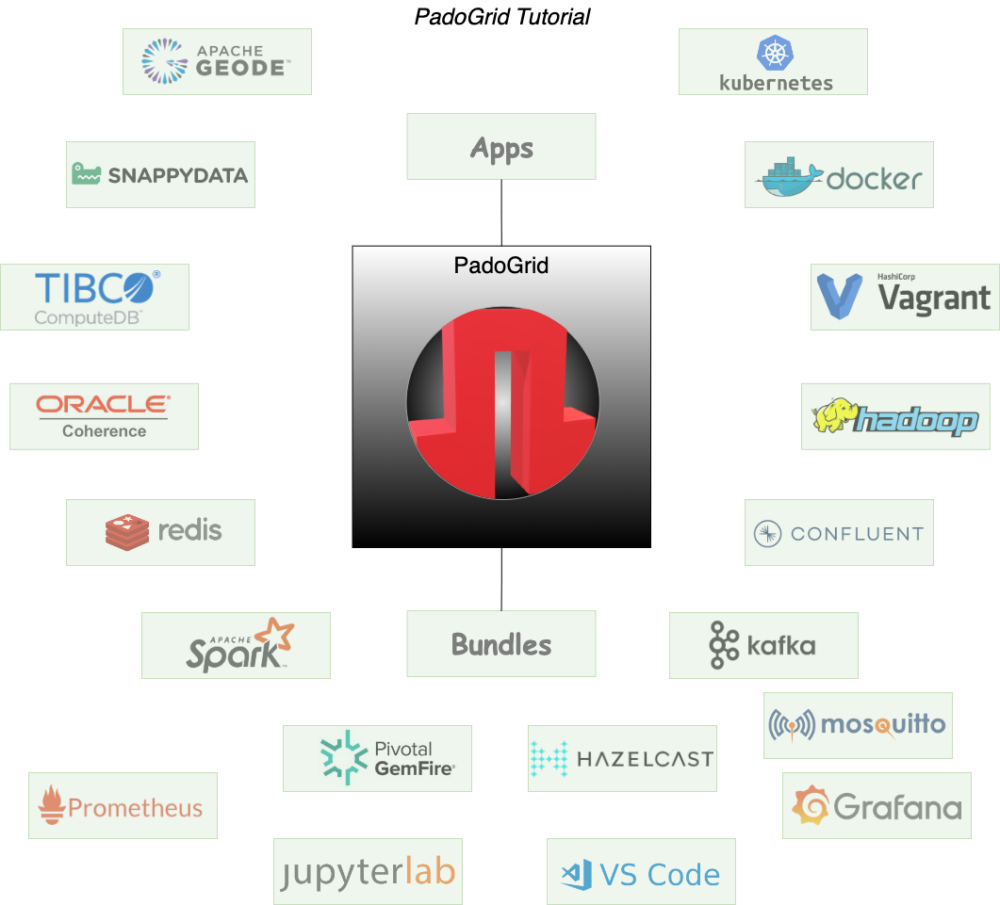

 [*PadoGrid*](https://github.com/padogrid) | [*Catalogs*](https://github.com/padogrid/catalog-bundles/blob/master/all-catalog.md) | [*Manual*](https://github.com/padogrid/padogrid/wiki) | [*FAQ*](https://github.com/padogrid/padogrid/wiki/faq) | [*Releases*](https://github.com/padogrid/padogrid/releases) | [*Templates*](https://github.com/padogrid/padogrid/wiki/Using-Bundle-Templates) | [*Pods*](https://github.com/padogrid/padogrid/wiki/Understanding-Padogrid-Pods) | [*Kubernetes*](https://github.com/padogrid/padogrid/wiki/Kubernetes) | [*Docker*](https://github.com/padogrid/padogrid/wiki/Docker) | [*Apps*](https://github.com/padogrid/padogrid/wiki/Apps) | [*Quick Start*](https://github.com/padogrid/padogrid/wiki/Quick-Start)

---

# PadoGrid Tutorial

This tutorial bundle covers PadoGrid essentials.

## Installing Bundle

This bundles should be installed as a workspace as follows.

```bash
install_bundle -download -workspace bundle-none-tutorial-padogrid
```

## Use Case

This bundle provides step-by-step hands-on instructions for understanding PadoGrid basics. You will learn how to install PadoGrid and accompanying products, manage clusters, ingest data, monitor clusters.



## Required OS/Platform

One of the following OS's or platforms:

- Linux
- macOS
- Windows (Cygwin, WSL)
- Docker
- Kubernetes

## Required Software

- [Bash](https://www.gnu.org/software/bash/)
- [Maven 3.x](https://maven.apache.org/download.cgi)
- [Git](https://maven.apache.org/download.cgi)
- [JDK 8+](https://www.oracle.com/java/technologies/downloads/)
- [jq](https://stedolan.github.io/jq/)

## Table of Contents

This tutorial is broken down to sections in individually enumerated markdown files as follows.

- [00-installation.md](00-installation.md)
- [01-help.md](01-help.md)
- [02-create-rwe.md](02-create-rwe.md)
- [03-install-bundle.md](03-install-bundle.md)
- [04-create-hazelcast.md](04-create-hazelcast.md)
- [05-vm-workspace.md](05-vm-workspace.md)
- [06-start-hazelcast.md](06-start-hazelcast.md)
- [07-ingest-data-hazelcast.md](07-ingest-data-hazelcast.md)
- [08-desktop-hazelcast.md](08-desktop-hazelcast.md)
- [09-grafana-hazelcast.md](09-grafana-hazelcast.md)
- [10-close-workspace.md](10-close-workspace.md)
- [11-install-geode.md](11-install-geode.md)
- [12-create-geode.md](12-create-geode.md)
- [13-ingest-data-geode.md](13-ingest-data-geode.md)
- [14-grafana-geode.md](14-grafana-geode.md)
- [15-stop-geode.md](15-stop-geode.md)
- [16-group-clusters.md](16-group-clusters.md)
- [17-stop-workspaces.md](17-stop-workspaces.md)
- [18-install-pado.md](18-install-pado.md)
- [19-create-padolite.md](19-create-padolite.md)
- [20-create-padodesktop.md](20-create-padodesktop.md)
- [21-stop-padolite.md](21-stop-padolite.md)
- [22-create-pado.md](22-create-pado.md)
- [23-ingest-data-pado.md](23-ingest-data-pado.md)
- [24-monitor-pado.md](24-monitor-pado.md)
- [25-stop-pado.md](25-stop-pado.md)
- [26-bundles.md](26-bundles.md)
- [27-multitenancy.md](27-multitenancy.md)

## Introduction

PadoGrid is a productivity toolkit for managing user workspaces in the server-side. It is commonly used for creating distributed workspaces on your laptop to manage various clustering products running locally and remotely. Managing clustering (or data grid) products such as GemFire, Hazelcast, Redis, Coherence, Spark, Kafka, Hadoop, etc. is a complex task that often requires development and maintenance of custom scripts. Each product comes with a simple set of script but they are typically for running a single cluster member instance on your local machine. You are left with the time-consuming task of manually deploying, configuring, running, and managing each member that belongs to a cluster. The complexity of this task multiplies as you add more members to the cluster and include more clusters and products in your system architecture, and not to mention, a steep learning curve of each product's scripts demanding a significant amount of time and efforts.

PadoGrid solves this problem by providing a single, unified set of commands for managing data grid products. The same set of commands applies to all the [supported data grid products](https://github.com/padogrid/padogrid/wiki/Supported-Data-Grid-Products-and-Downloads). For products that are not supported, they can be found in *bundles* as part of solutions. Each bundle is a shrink-wrapped, turnkey solution capturing an end-to-end use case that you can simply install and run. Including this tutorial bundle, there are numerous [public online bundles](https://github.com/padogrid/catalog-bundles/blob/master/all-catalog.md) that are made readily available for you to use. All for free and all for fun!

PadoGrid is built from the beginning to bring the concept of *distributed workspaces* to practice by allowing you to create sandbox environments on the fly. PadoGrid isolates each workspace that you create from other workspaces so that you can instead focus on your application. The bundles are the direct results of this concept as they need to be run in isolated environments to prevent workspace conflicts. In this tutorial bundle, we will explore some of the commonly used PadoGrid commands to understand the benefits of having distributed workspaces. 

---

 [*PadoGrid*](https://github.com/padogrid) | [*Catalogs*](https://github.com/padogrid/catalog-bundles/blob/master/all-catalog.md) | [*Manual*](https://github.com/padogrid/padogrid/wiki) | [*FAQ*](https://github.com/padogrid/padogrid/wiki/faq) | [*Releases*](https://github.com/padogrid/padogrid/releases) | [*Templates*](https://github.com/padogrid/padogrid/wiki/Using-Bundle-Templates) | [*Pods*](https://github.com/padogrid/padogrid/wiki/Understanding-Padogrid-Pods) | [*Kubernetes*](https://github.com/padogrid/padogrid/wiki/Kubernetes) | [*Docker*](https://github.com/padogrid/padogrid/wiki/Docker) | [*Apps*](https://github.com/padogrid/padogrid/wiki/Apps) | [*Quick Start*](https://github.com/padogrid/padogrid/wiki/Quick-Start)
